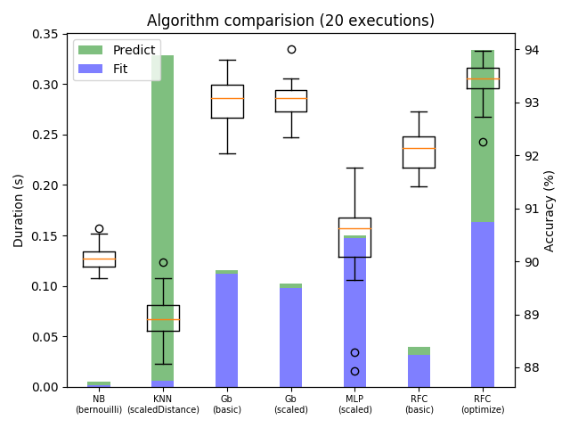
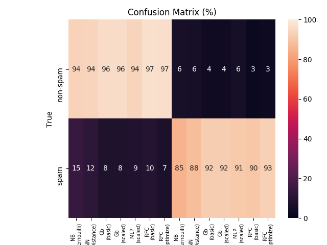

# 

Ultimate spam detector

## Getting Started

These instructions will get you a copy of the project up and running on your
local machine for development and testing purposes. See deployment for notes on
how to deploy the project on a live system.

### Prerequisites

-   `python3`
-   `pip3`
-   Tkinter

#### Debian

    sudo apt install python3 python3-pip python3-tk

### Installing

This will install and activate a virtual python environment in the dev directory.

#### Windows

    .\activate

#### Unix

    . activate

### Running

#### Benchmarks

    bin/slipspam bench [-e <nb executions>]

exemple:

    bin/slipspam bench -e 5

####

### Deactivating

To deactivate the virtual environment, simply type `deactivate`

## Deployment

_not deployable yet..._

## Documentation

### CLI

You can get the CLI documentation by running the following command:

    bin/slipspam --help

## Built With

-   [scikit-learn](https://scikit-learn.org/stable/) - Machine learning library

## Authors

-   **Anass ELANBARI** - [anassCoding](https://github.com/anassCoding)
-   **Gwendal LE STANGUENNEC** - [GwendalLES](https://github.com/GwendalLES)
-   **Etienne LELOUËT** - [etienne-lelouet](https://github.com/etienne-lelouet)
-   **Nicolas PEUGNET** - [n-peugnet](https://github.com/n-peugnet)

See also the list of [contributors](https://github.com/slipsoft/slipspam/contributors)
who participated in this project.

